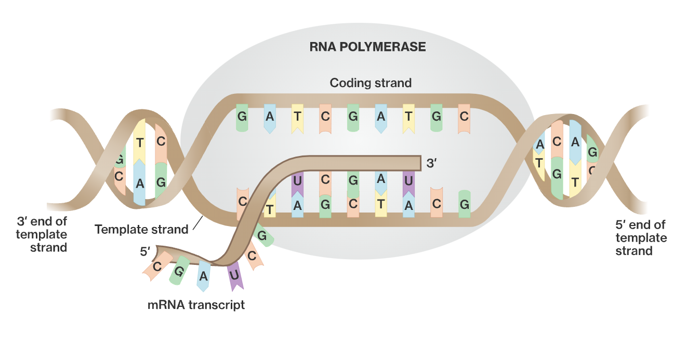

# ILM

**Intuitionistic Language Models (ILM)** is a research-driven toolkit for developing language models with hierarchical tokenization. This approach structures tokens across multiple levels, enabling the representation of both local and global linguistic patterns without relying on a fixed alphabet. The repository currently provides a hierarchical tokenizer as a foundation for future developments. In subsequent releases, ILM aims to extend this work by introducing tools for training, evaluating, and deploying language models that leverage structured token representations.

A key motivation behind this approach is the observation that the English language contains approximately $N = 250,000$ words. In principle, each word can be encoded as a sequence of $\lceil \log_2(N) \rceil = 18$ bits. Notably, since $18 = 3 \cdot 6$, it is possible to structure words as sequences of three syllables, where each syllable is drawn from a set of $2^6 = 64$ possible symbols. This is in contrast to widely used tokenization methods such as *tiktoken*, which rely on much larger vocabularies, sometimes exceeding 50,000 tokens. The choice of a limited, structured alphabet offers a more compact and compositional representation of language, reducing reliance on memorized tokens and fostering a systematic approach to language modeling.

#### Biology as an inpiration

<div align="center">
  
</div>

This principle echoes the fundamental encoding strategy found in biological systems. In genetics, DNA relies on just 64 codons to encode the vast complexity of life. Similarly, by adopting a structured and minimal set of building blocks, ILM aims to create a tokenization framework that is both expressive and efficient.

#### Example
The hierarchical tokenization process assigns structured representations to words, allowing for a more systematic decomposition of language. Below is an example of how words are mapped into a three-level token structure, where each component captures an aspect of the token hierarchy:

```
'Think': [0, 0, 0]
'Excluding': [0, 0, 1]
'Allen': [0, 0, 2]
'Bill': [0, 0, 3]
'Jenna': [0, 0, 4]
'Pick': [0, 0, 5]
'Tyler': [0, 0, 6]
'Choosing': [0, 0, 7]
'Geoff': [0, 0, 8]
'Marius': [0, 0, 9]
'Spinners': [0, 0, 10]

(...)

' pursuers': [63, 44, 21]
'1073741825': [63, 44, 22]
' crearlos': [63, 44, 23]
' информации': [63, 44, 24]
' longtemps': [63, 45, 0]
' Virgo': [63, 45, 1]
' Zacharias': [63, 45, 2]
' 1812': [63, 45, 3]
' exterminator': [63, 45, 4]
' centigrade': [63, 45, 5]
' datacenter': [63, 45, 6]
' Xylophoria': [63, 45, 7]
' domesticating': [63, 45, 8]
' 1691': [63, 45, 9]

(...)

```

By designing a hierarchical tokenizer as a core building block, ILM seeks to establish a structured framework for tokenization that can be directly integrated into future language model architectures. The toolkit is intended to provide researchers and practitioners with flexible and interpretable tokenization methods, forming the basis for more expressive and efficient language models.

## Overview

This repository provides a set of tools to:
- **Generate a hierarchical tokenizer** from a training text file by computing token weights based on their relative positions within different text segments (e.g., sentences, paragraphs).
- **Build a composite mapping from tokens to codes** (and vice versa) that is ideal for structured language modeling.
- **Integration with Neural Network Pipelines:** The tokenizer produces token codes that can serve as inputs for language models. In a typical pipeline, the neural network would output a probability distribution over the 64 token options for each syllable position, which can then be mapped back to tokens using the provided detokenizer.

## Repository Structure

- **`tokenizer/intuit.py`**: Contains the main functions for tokenization, including generating, saving, and loading tokenizers.
- **`tokenizer/create_training.py`**: (Optional) Script to create a default training dataset (`training_input.txt`) from a parquet file.
- **`tests/`**: Contains unit tests for validating functionality.  
- **`data/`**: Place your training input and tokenizer mapping files here.
- **`img/`**: Contains images used in the documentation (e.g., the neural network diagram).

## Installation

Install the required dependencies by running:

```bash
pip install -r requirements.txt
```

## Quickstart

### Using the Code in the Repo

To integrate the tokenizer with your projects, import the module from the `tokenizer` folder as follows:

```python
import sys
sys.path.insert(1, "./")
from tokenizer.intuit import create_tokenizer, load_tokenizer
```

### Creating a Tokenizer

If you have your own dataset, place your training text file (e.g., `training_input.txt`) in the `data/` directory and create a tokenizer:

```python
from tokenizer.intuit import create_tokenizer

# Create tokenizer and save the mapping to a JSON file
tokenizer, detokenizer = create_tokenizer(source_file="data/training_input.txt", target_file="data/tokenizer_v1.json")
```

### Loading an Existing Tokenizer

To load a previously saved tokenizer mapping:

```python
from tokenizer.intuit import load_tokenizer

# Load the tokenizer mapping from the JSON file
tokenizer, detokenizer = load_tokenizer("data/tokenizer_v1.json")
```

### Optional: Creating a Default Training Dataset

If you do not have your own training dataset, you can create a default `training_input.txt` by running the provided script:

```bash
python tokenizer/create_training.py
```

This script reads data from a parquet file using pandas and generates `training_input.txt` in the `data/` directory. Alternatively, you can use your own dataset.

### Sample Usage with Language Models

Below is an example demonstrating how to integrate the tokenizer into a language model pipeline:

```python
import sys
sys.path.insert(1, "./")
from tokenizer.intuit import create_tokenizer, load_tokenizer

option = 2
if option == 1:
    tokenizer, detokenizer = create_tokenizer(source_file="data/training_input.txt", target_file="data/tokenizer_v1.json")
elif option == 2:
    tokenizer, detokenizer = load_tokenizer("data/tokenizer_v1.json")

line_index = 20
with open("data/training_input.txt", "r", encoding="utf-8") as file:
    for index, line in enumerate(file):
        if index == line_index:
            sample_line = line
            break

# Tokenize the sample line for use as input to a language model
token_codes = tokenizer(sample_line)
print("Token Codes:", token_codes)

# For decoding LM outputs, convert token codes back to text
reconstructed_text = detokenizer(token_codes)
print("Reconstructed Text:", reconstructed_text)
```

## Integration with Neural Networks

The provided tokenizer and detokenizer functions convert text to structured token sequences suitable for language model inputs. In a typical neural network pipeline, the model predicts a probability distribution over the 64 possible tokens for each syllable position. The mapping provided by this toolkit allows you to interpret these predictions and convert them back into human-readable tokens.

## Tutorial

1. **Prepare Your Data:**  
   Place your training text file (e.g., `training_input.txt`) in the `data/` directory. Use your own dataset or create one using:
   ```bash
   python tokenizer/create_training.py
   ```

2. **Create the Tokenizer:**  
   Generate the tokenizer mapping from your dataset. The mapping is stored in JSON format, so you can reload it later for inference or integration with your language model.

3. **Integrate with Your Neural Network:**  
   Use the tokenizer to convert text to token sequences, which serve as inputs for your language model. The neural network outputs can be mapped back to text using the detokenizer.

4. **Run Unit Tests:**  
   Validate the functionality of the module by running the tests:
   ```bash
   pytest tests/test_*
   ```
   This ensures that all tokenization and mapping functions perform as expected.

## License

This project is licensed under the MIT License. See the [LICENSE](LICENSE) file for more details.

## Contact

For any questions or suggestions, please open an issue.
