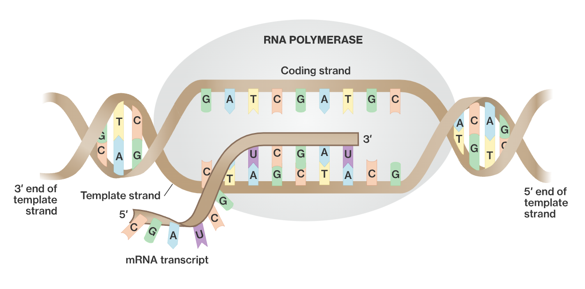

<p align="center">
  <p align="center"></p>
  <p align="center"><em>A toolkit for language models based on hierarchical tokenization</em></p>
</p>

# Introduction

### Definition and motivations

**Intuitionistic Language Models (ILM)** is a research-driven toolkit for building language models on top of hierarchical tokenization. Instead of giving each word one opaque entry in a large vocabulary, ILM represents it as a composition of a few smaller coordinates arranged across several levels.

The repository currently ships four pieces:

- the original **relative-position tokenizer**,
- a newer **embedding-cluster tokenizer** built on PCA and residual centroid coding,
- **semantic spelling exports** for inspecting what a tokenizer has learned, and
- a small **transformer sandbox** for training experiments.

### Why "intuitionistic"?

The name **intuitionistic** comes from the constructive tradition in mathematics. In intuitionistic logic, a proposition is not meaningful simply because it could be true in some abstract sense. Its meaning is tied to the construction of a proof, so claiming that an object has a property means being able to build that proof from well-defined primitives, axioms, and rules.

ILM borrows this as a guiding analogy for language modeling. Rather than treating each word as an opaque atomic label, the tokenizer expresses words as compositions of smaller semantic coordinates. A word such as `cannot` may become something like `negation:necessity:change`. That is not a formal proof, but it is a constructive decomposition that shows how the word is assembled from interpretable parts.

The longer-term intuition is that generation should become more proof-like. A model should not merely recall the next token, but progressively build a proposition out of structured primitives. The tokenizer is the first layer of that idea: it defines a small alphabet of coordinates, and the model learns how those coordinates compose into words, phrases, and eventually complete statements.

One concrete motivation is a counting argument. English contains roughly $N = 250{,}000$ words, so in principle each word can be encoded in

$$\lceil \log_2(N) \rceil = 18$$

bits. Since $18 = 3 \cdot 6$, those bits split naturally into three syllables, each drawn from an alphabet of $2^6 = 64$ symbols.

Widely used tokenizers take the opposite route, relying on vocabularies that often exceed $50{,}000$ tokens. A small, structured alphabet gives a more compact and compositional view of language, which reduces the reliance on memorized tokens and encourages a more systematic approach to language modeling.

### Biology as an inspiration

<div align="center">
  
</div>

This principle echoes a fundamental encoding strategy found in biological systems. In genetics, DNA relies on a four-symbol alphabet of nucleotide bases. These bases behave like biological tokens. They are read in three-token codons, giving $4^3 = 64$ possible codon words.

A codon is built from ordered biological tokens. The first token begins a family, the second token narrows the biochemical class, and the third token completes the exact amino acid or stop signal. The final token often changes the meaning less than the earlier tokens, which gives the codon table a nested and constructive structure.

ILM borrows this constructive shape. A code such as `3:50:20` is not three interchangeable labels. The first coordinate names a broad semantic region, the second refines it, and the third completes the word by separating close neighbors inside that region. A partial code is not yet the word, but it already carries evidence about the kind of word being constructed.

The parallel is structural rather than arithmetic. DNA's 64 is the size of the whole codon space ($4^3$), while ILM's 64 is the size of a single coordinate vocabulary.

### Ideograms as an inspiration

ILM also draws on ideographic and morphographic writing systems. Egyptian hieroglyphs use signs that can act as sounds, words, or semantic classifiers. Many Chinese characters combine one component that hints at meaning with another that hints at sound. ILM does not reproduce either system directly. The useful analogy is simply that a written unit can be composed from smaller interpretable parts.

The character `明`, for instance, combines `日` (sun) and `月` (moon) to suggest brightness. `河` (river) follows a different pattern: the water component `氵` places it in a water-related semantic family, while `可` cues its pronunciation. In both cases, a compact set of recurring components makes words readable as structured compositions rather than isolated symbols.

ILM's embedding-cluster tokenizer is a machine-learned version of that idea. Each word becomes three base-64 coordinates, and each coordinate reads as a semantic atom. Different training runs may discover different coordinate systems, much as different projections of one space can pick different axes. The goal is not a single canonical decomposition, but a stable pattern of meaningful neighborhoods.

### Example: semantic spelling

The embedding-cluster tokenizer can export a human-readable semantic spelling file. The model still trains on numeric codes such as `12:4:39`, but the sidecar file lets you inspect those codes as ideogram-like compositions:

```python
{
   " spakest": "verbs:growth:possessions",
   " fester": "verbs:growth:confinement",
   " jumpeth": "verbs:growth:lamentation",
   " grow": "verbs:growth:terror",
   " swallow": "verbs:growth:service",

   " cannot": "negation:necessity:change",
   " without": "negation:necessity:courage",
   " unable": "negation:necessity:delay",
   " unless": "negation:necessity:interruption",

   "Knows": "plurals:affection:approval",
   "Snakes": "plurals:authority:violence",
   " Hydra": "plurals:animals:warfare",
   "Masters": "plurals:approval:treason"
}
```

The first coordinate usually captures a broad region such as `verbs`, `negation`, or `plurals`. The second refines that region into a semantic subspace such as `growth`, `necessity`, or `authority`. The third acts as a residual detail. It rarely reads like a dictionary definition, but it separates nearby words that share the same neighborhood.

Treat these labels as interpretive heuristics rather than ground-truth grammar tags. `Knows` is not a plural noun, for instance, yet it lands in a family whose centroid is labeled `plurals` because so many of its neighbors are plural-looking words such as `Snakes`, `Spies`, and `Neighbours`. What matters is the numeric coordinate. The semantic spelling is only a readable gloss on the neighborhood the model found.

Because both the clustering and the centroid labeling are learned, repeated builds produce different yet equally meaningful spellings. One build may render `cannot` as `negation:necessity:change`, while another files the same word under an `absence` family. That variation is expected. The signal worth watching is that related words stay close to each other and continue to share interpretable atoms.

### Example: numeric tokenizer codes

Internally, the tokenizer stores only compact numeric codes. The example below shows the same three word families as above, this time in the three-level structure the model actually consumes:

```python
{
   " spakest": "0:2:19",
   " fester": "0:2:24",
   " jumpeth": "0:2:36",
   " grow": "0:2:39",
   " swallow": "0:2:51",
   "drench": "0:2:55",
   " hoard": "0:4:4",
   " coign": "0:4:22",

   " cannot": "3:50:0",
   " without": "3:50:4",
   "Without": "3:50:15",
   " undo": "3:50:20",
   " counter": "3:50:22",
   " differs": "3:50:27",
   " unable": "3:50:29",
   "without": "3:50:35",
   "Except": "3:50:36",

   "Knows": "1:57:25",
   "Snakes": "1:58:2",
   "Spies": "1:58:19",
   " Hydra": "1:58:20",
   "Jacks": "1:58:39",
   "Bears": "1:58:43",
   "Neighbours": "1:58:51",
   " Jacks": "1:58:52"
}
```

Notice that each group shares a first coordinate: `0` for the verb-like words, `3` for the negation-like words, and `1` for the plural-like words. The matching sidecar is what puts names to those regions. That pairing is what makes the embedding-cluster tokenizer useful for analysis. The model only ever sees the numbers, while the sidecar lets a human read the structure behind them.

Taken together, this makes the hierarchical tokenizer a building block that drops straight into a language model architecture: flexible enough to experiment with, and interpretable enough to debug.

## Overview

This repository provides tools to:
- **Generate hierarchical tokenizers** from a training text file, using either relative-position statistics or embedding-space residual clustering.
- **Build a composite mapping** from tokens to codes and back, suited to structured language modeling.
- **Inspect semantic spellings** that translate numeric codes into human-readable centroid atoms.
- **Plug into LM pipelines.** The tokenizer produces token codes that feed straight into a language model. A typical network outputs a probability distribution over the 64 options at each syllable position, and the provided detokenizer maps those back to text.

## Repository structure

- **`ilm/tokenizer/api.py`**: SDK entry point for creating and loading tokenizers.
- **`ilm/tokenizer/core.py`**: shared token extraction, JSON IO, and tokenizer/detokenizer helpers.
- **`ilm/tokenizer/relative_position.py`**: the original tokenizer method, based on relative token-position statistics.
- **`ilm/tokenizer/embedding_cluster.py`**: tokenizer method based on embeddings, PCA, and residual centroid coding.
- **`ilm/tokenizer/create_training.py`**: optional script that builds a default training dataset (`training_input.txt`) from a parquet file.
- **`ilm/transformer/model.py`**: the transformer model used for training experiments.
- **`ilm/utils/`**: interactive chat interface and checkpoint versioning helpers.
- **`sandbox/`**: experiment scripts that wire a tokenizer, a training text, and a model together.
- **`tests/`**: unit tests covering the toolkit.
- **`data/`**, **`models/`**: training inputs and tokenizer mappings, and saved checkpoints.
- **`docs/`**, **`img/`**: background notes and documentation images.

For command-by-command instructions on the scripts, see [HOWTO.md](HOWTO.md).

## Installation

Install the dependencies with:

```bash
pip install -r requirements.txt
```

## Quickstart

### Using the code in the repo

To use the tokenizer in your own project, import it from the `ilm.tokenizer` package:

```python
import sys
sys.path.insert(1, "./")
from ilm.tokenizer import create_tokenizer, load_tokenizer
```

### Creating a tokenizer

Place your training text file (for example `training_input.txt`) in the `data/` directory, then build a tokenizer from it:

```python
from ilm.tokenizer import create_tokenizer

# Create the original relative-position tokenizer and save the mapping to a JSON file
tokenizer, detokenizer = create_tokenizer(
    source_file="data/training_input.txt",
    target_file="data/tokenizer_v1.json",
    method="relative-position",
)
```

The embedding-cluster method calls the OpenAI embedding API, so it needs an `OPENAI_API_KEY` entry in a `.env` file at the project root:

```python
from ilm.tokenizer import create_tokenizer

tokenizer, detokenizer = create_tokenizer(
    source_file="data/training_input.txt",
    target_file="data/tokenizer_embedding_cluster_v1.json",
    method="embedding-cluster",
    cluster_method="spherical-kmeans",
    reduced_dim=10,
    embedding_batch_size=512,
    semantic_spelling_file="data/tokenizer_embedding_cluster_v1.semantic.json",
)
```

Start with `reduced_dim=10`. It stays faithful to the low-dimensional semantic-basis idea while keeping enough nuance for readable, ideogram-like decompositions. Drop to `8` for a slightly more compressed baseline, or to `3` for an aggressively symbolic projection.

`semantic_spelling_file` is optional. It writes a human-readable sidecar JSON that maps each token to its centroid labels, for example `" apple": " fruit:sweet: red"`. By default, those labels are the source tokens closest to each centroid. For more readable labels, pass `centroid_label_method="llm"`, and optionally pick a model with `centroid_label_model` (the default is `gpt-5.6-terra`). LLM labels are validated and repaired, so duplicate, generic, or overlong atoms get replaced before the closest-token fallback is used as a last resort.

### Loading an existing tokenizer

To load a previously saved tokenizer mapping:

```python
from ilm.tokenizer import load_tokenizer

# Load the tokenizer mapping from the JSON file
tokenizer, detokenizer = load_tokenizer("data/tokenizer_v1.json")
```

### Optional: creating a default training dataset

If you do not have a dataset of your own, the bundled script generates a default one:

```bash
python ilm/tokenizer/create_training.py
```

It reads the `garage-bAInd/Open-Platypus` [dataset](https://huggingface.co/datasets/garage-bAInd/Open-Platypus) and writes `training_input.txt` into the `data/` directory.

### Sample usage with language models

A fuller example of wiring the tokenizer into a language model pipeline:

```python
import sys
sys.path.insert(1, "./")
from ilm.tokenizer import create_tokenizer, load_tokenizer

mode = "load"
if mode == "build":
    tokenizer, detokenizer = create_tokenizer(
        source_file="data/training_input.txt",
        target_file="data/tokenizer_v1.json",
        method="relative-position",
    )
elif mode == "load":
    tokenizer, detokenizer = load_tokenizer("data/tokenizer_v1.json")

line_index = 20
with open("data/training_input.txt", "r", encoding="utf-8") as file:
    for index, line in enumerate(file):
        if index == line_index:
            sample_line = line
            break

# Tokenize the sample line for use as input to a language model
token_codes = tokenizer(sample_line)
print("Token Codes:", token_codes)

# For decoding LM outputs, convert token codes back to text
reconstructed_text = detokenizer(token_codes)
print("Reconstructed Text:", reconstructed_text)
```

## Methodology

1. **Prepare your data.** Place your training text file (for example `training_input.txt`) in the `data/` directory. Bring your own dataset, or generate one with:
   ```bash
   python ilm/tokenizer/create_training.py
   ```

2. **Create the tokenizer.** Build the tokenizer mapping from that dataset. The mapping is saved as JSON, so you can reload it later for inference or for integration with your model.

3. **Integrate with your neural network.** Use the tokenizer to turn text into token sequences that feed your language model, and the detokenizer to turn the model's outputs back into text.

4. **Run the unit tests.** Confirm that tokenization and mapping behave as expected:
   ```bash
   pytest tests/test_*
   ```

## License

This project is licensed under the MIT License. See the [LICENSE](LICENSE) file for details.

## Contact

For questions or suggestions, please open an issue.
